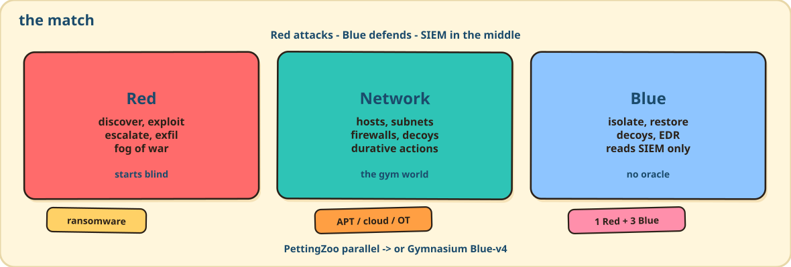
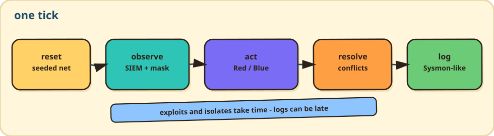
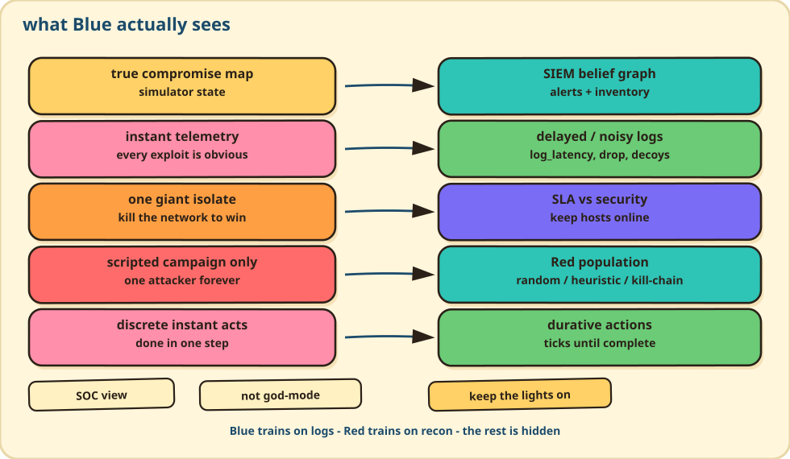

<div align="center">


# NetForge

**Cybersecurity gym for reinforcement learning**

Red attacks a network. Blue contains it from SIEM, not from an oracle.
PettingZoo (1 Red + 3 Blue) or Gymnasium (one Blue vs scripted Red).

**Python 3.12+** · **PettingZoo** · **Gymnasium** · **Not on PyPI**

[Docs](https://reforcemind.github.io/NetForge_RL/) ·
[Start](https://reforcemind.github.io/NetForge_RL/getting-started.html) ·
[Python](https://reforcemind.github.io/NetForge_RL/python-quickstart.html) ·
[Cyber](https://reforcemind.github.io/NetForge_RL/cybersec/overview.html) ·
[Contributing](CONTRIBUTING.md)

<p>
  
</p>
</div>

## 📰 News

**🗓️ September 2026**

- 🛡️ **20** — Gym ids: PettingZoo `netforge/ransomware-v4` (1 Red + 3 Blue) and Gymnasium `NetForge/Blue-v4`. Blue trains on SIEM belief graphs, not the true map.
- 📟 **20** — `netforge` CLI: `run`, `evaluate`, `questions`, HTML replay. Packs for hospital, cloud, APT, IoT, OT.
- 🏗️ **20** — Arena train / dev / hidden splits. Typed `EnvConfig`. Sphinx docs, same kit as [FlowEdge](https://github.com/reforcemind/FlowEdge).

🏷️ [Changelog](docs/changelog.md) · 📘 [Docs](https://reforcemind.github.io/NetForge_RL/)

***

## The problem

A defender does not get the true compromise map. The SOC sees Sysmon-like logs
that can be late, dropped, or noisy. Red starts blind and only sees hosts it has
discovered. Exploits and isolates take ticks, not one step.

A gym that hands Blue an oracle, pays for isolating the whole net, or scores
mean reward against one scripted Red is training the wrong job.

## What NetForge does

Each tick, agents pick `[action_type, host_index]`. Actions run, conflicts
resolve, SIEM fires, Blue obs update from the buffer.

**Red** — discover, exploit CVEs, escalate, exfil, or hit a PLC.
**Blue** — isolate, ACL, restore, decoys (`169.254.x.x`). Quiet Red may never
show up in logs.
**Kinetic** — `OverloadPLC` can end the episode for Blue.

```python
import netforge_rl
import gymnasium as gym
from pettingzoo import make

env = make("parallel", "netforge/ransomware-v4", max_ticks=80)
obs, infos = env.reset(seed=0)
blue = gym.make("NetForge/Blue-v4", max_ticks=80)
```

<p align="center">
  
</p>

## Why this, not the usual stack

<p align="center">
  
</p>

Blue never sees the true map. Logs can lag. Isolate-everything wrecks SLA.
Eval uses a Red population, not one campaign. Trainers (MAPPO / QMIX / …) stay
in your repo.

## First run

Not on PyPI. Python 3.12+.

```bash
python -m pip install 'netforge-rl @ git+https://github.com/reforcemind/NetForge_RL'
netforge run hospital_ransomware --replay replay.html
```

From a clone:

```bash
git clone https://github.com/reforcemind/NetForge_RL.git
cd NetForge_RL
pip install -e ".[dev]"
netforge run ransomware --seed 0 --max-ticks 40
```

```bash
python -m netforge --help
```

| Piece | |
|---|---|
| Agents | `red_operator`, `blue_dmz`, `blue_internal`, `blue_restricted` |
| Action | `MultiDiscrete([32, 100])`, mask `int8[132]` |
| Blue obs | vector + SIEM embedding + belief graph |
| Families | ransomware, APT, cloud, IoT, OT/Stuxnet |
| Trainers | your code. Not bundled. |

Gate: `scripts/verify_all.sh` or `scripts/verify_local.ps1`. GitHub Actions is ruff + pytest + Sphinx. `docs.yml` deploys the site to GitHub Pages on `main`.

## Citation

```bibtex
@misc{jankowski2026netforgerlmultiagentsimulation,
      title={NetForge RL: A Multi-Agent Simulation Environment for Cyber Defense with Durative Actions},
      author={Igor Jankowski},
      year={2026},
      eprint={2604.09523},
      archivePrefix={arXiv},
      primaryClass={cs.LG},
      url={https://arxiv.org/abs/2604.09523},
}
```

MIT, with CybORG / DSTG notices in [LICENSE](LICENSE).
