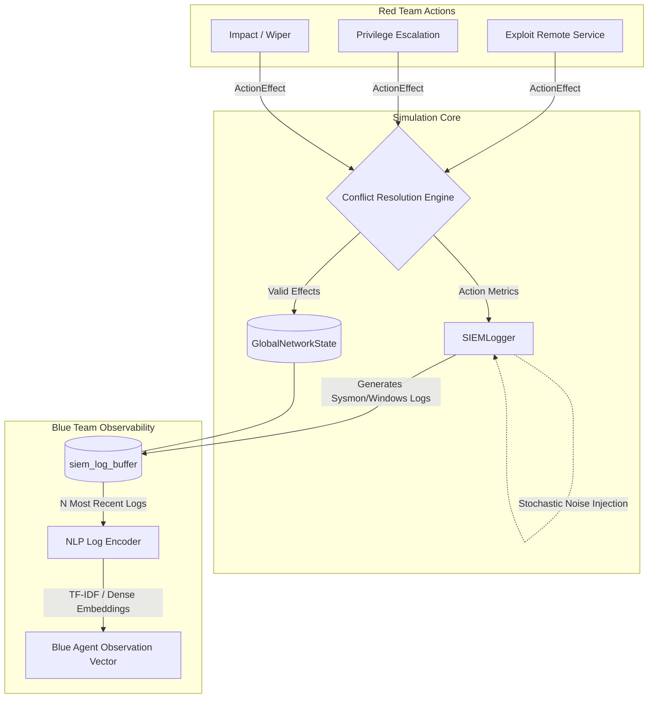

# NetForge Architecture

This document provides a technical overview of how the NetForge Multi-Agent Reinforcement Learning (MARL) simulator operates, focusing on the execution loop and communication architecture between the environment and its agents.

## 1. Simulation Execution Loop

The simulation loop is highly parallelized for MARL agents. At each tick (`parallel_env.step()`), all agents submit their chosen actions. The environment processes these concurrently, determines hardware/state effects, resolves temporal conflicts (e.g., Red attacking exactly when Blue mitigates), and applies the changes to the `GlobalNetworkState`.

```mermaid
sequenceDiagram
    participant Agents
    participant Environment (parallel_env)
    participant Action Registry
    participant ConflictResolutionEngine
    participant GlobalNetworkState

    Agents->>Environment (parallel_env): step({agent_id: action_str})
    
    Environment (parallel_env)->>Action Registry: Parse action strings to Action Objects
    Action Registry-->>Environment (parallel_env): list of BaseAction
    
    rect rgb(30, 40, 50)
        Note right of Environment (parallel_env): Action Execution Phase
        Environment (parallel_env)->>Environment (parallel_env): action.execute(GlobalNetworkState)
        Environment (parallel_env)-->>Environment (parallel_env): Dictionary of ActionEffects
    end
    
    Environment (parallel_env)->>ConflictResolutionEngine: resolve(effects_dict)
    Note right of ConflictResolutionEngine: Suppresses Red ActionEffects<br/>if temporal collision with Blue defense
    ConflictResolutionEngine-->>Environment (parallel_env): Filtered effects_dict
    
    Environment (parallel_env)->>GlobalNetworkState: Apply ActionEffect.state_deltas
    GlobalNetworkState-->>Environment (parallel_env): State updated (Privilege, Topology)
    
    Environment (parallel_env)-->>Agents: Return new observations, rewards, terminations
```

## 2. Communications and Observability (SIEM)

Blue agents do not see the entire network state natively. Instead, they rely on a simulated Security Information and Event Management (SIEM) pipeline. Red actions generate noise, which is captured by the `SIEMLogger` and fed into a Natural Language Processing (NLP) encoder.

## Component Details

### `BaseAction` and `ActionEffect`
All capabilities inherited by agents descend from `BaseAction`. When `execute()` is called, the logic determines the probability of success, checks vulnerability preconditions, and returns an `ActionEffect`. This effect contains explicit `state_deltas` (like changing a host's privilege to 'Root').

### `ConflictResolutionEngine`
Because MARL environments process steps simultaneously, a Red agent might exploit a host on the exact same tick a Blue agent patches it. The Conflict Resolution Engine enforces "Blue Supremacy" on temporal collisions — if a Blue action targets the same IP as a Red action in the same tick, the Red action is neutralized.

### `SIEMLogger` and `LogEncoder`
Real-world defenders parse raw telemetry. To mirror this, the `SIEMLogger` translates successful and failed actions into raw text strings matching standard Windows/Sysmon formats (e.g. `Event ID 4624`). It also injects benign background noise. The `LogEncoder` then vectorizes these string logs so the Blue agent's neural network can ingest them as dense observations.
