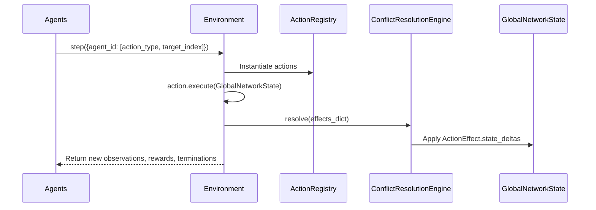
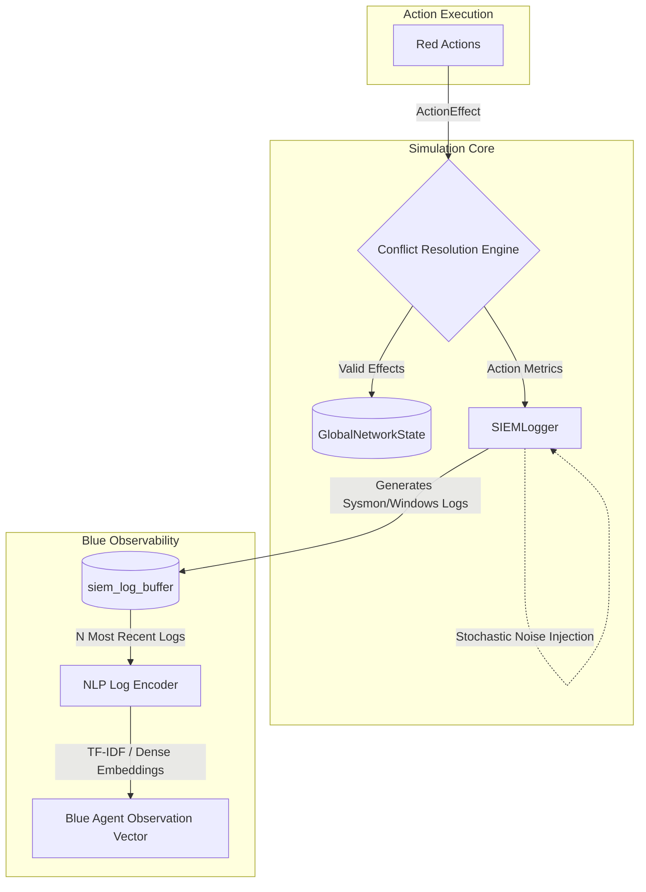

# Execution Architecture

## 1. Simulation Loop
The simulation loop is fully parallelized via the PettingZoo API (`parallel_env.step()`) and JAX vectorization (`jax.vmap`).

## 2. Telemetry Pipeline
Blue agent observations are generated exclusively through the simulated Security Information and Event Management (SIEM) pipeline. 

## 3. Component Details

### `BaseAction` and `ActionEffect`
All agent capabilities inherit from `BaseAction`. `execute()` returns an `ActionEffect` containing `state_deltas` determining specific state tensor modifications.

### `ConflictResolutionEngine`
Resolves temporal collisions occurring in the same parallel tick. Handled deterministically within the `EnvState` interpreter.

### `SIEMLogger` and `LogEncoder`
`SIEMLogger` translates state deltas into standardized string logs matching Windows/Sysmon syntax, injecting stochastic benign noise. When `log_latency > 0` it holds each log for that many ticks before it becomes visible, modelling a lagging SOC feed. `LogEncoder` vectorizes the buffer into dense observations.
