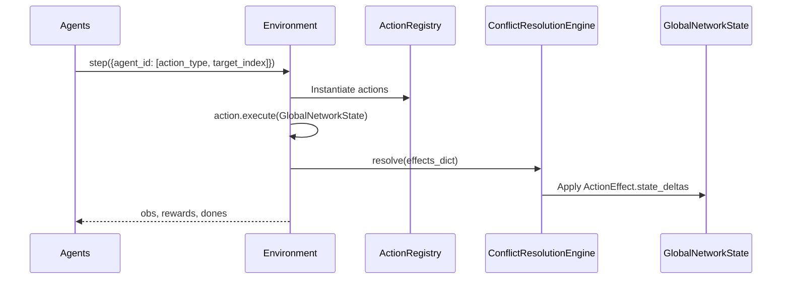
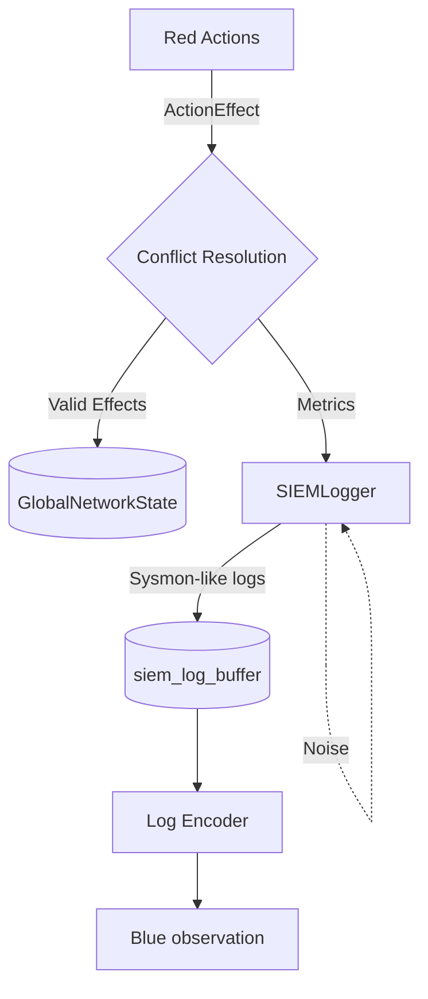

# Tick loop

Each step: agents pick `[action_type, host_index]`, actions run, conflicts
resolve, SIEM logs fire, Blue obs update from the buffer.

PettingZoo `parallel_env.step()`. JAX `vmap` is a throughput surrogate.

```mermaid
sequenceDiagram
    participant Agents
    participant Environment
    participant ActionRegistry
    participant ConflictResolutionEngine
    participant GlobalNetworkState

    Agents->>Environment: step({agent_id: [action_type, target_index]})
    Environment->>ActionRegistry: Instantiate actions
    Environment->>Environment: action.execute(GlobalNetworkState)
    Environment->>ConflictResolutionEngine: resolve(effects_dict)
    ConflictResolutionEngine->>GlobalNetworkState: Apply ActionEffect.state_deltas
    Environment-->>Agents: obs, rewards, dones
```

Blue obs come from SIEM only.

```mermaid
flowchart TD
    R1[Red Actions] -->|ActionEffect| CRE{Conflict Resolution}
    CRE -->|Valid Effects| GNS[(GlobalNetworkState)]
    CRE -->|Metrics| SL[SIEMLogger]
    SL -.->|Noise| SL
    SL -->|Sysmon-like logs| LB[(siem_log_buffer)]
    LB --> NLP[Log Encoder]
    NLP --> BO[Blue observation]
```

`BaseAction.execute()` returns `ActionEffect.state_deltas`.
Resolution is deterministic per tick. `log_latency` can delay logs.
